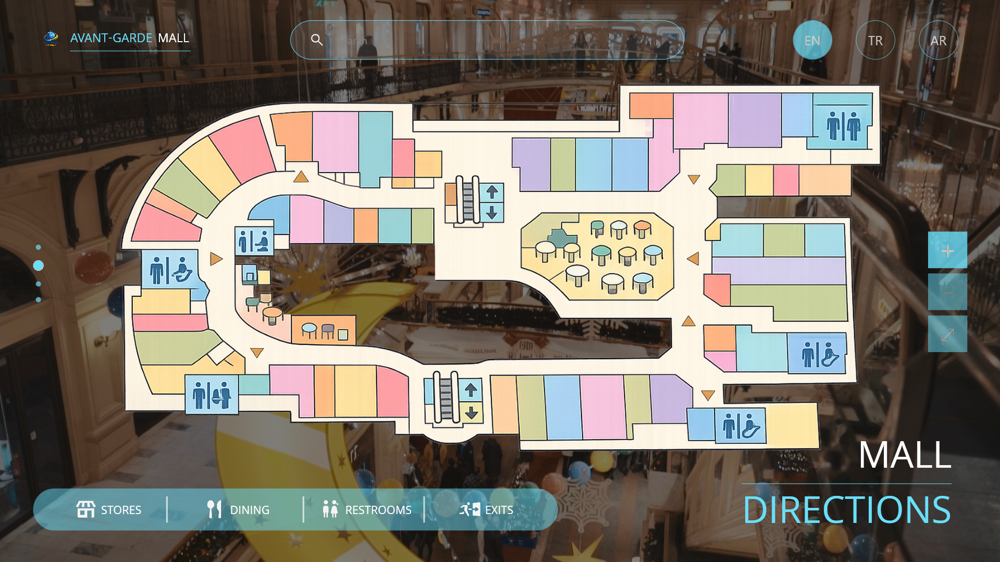
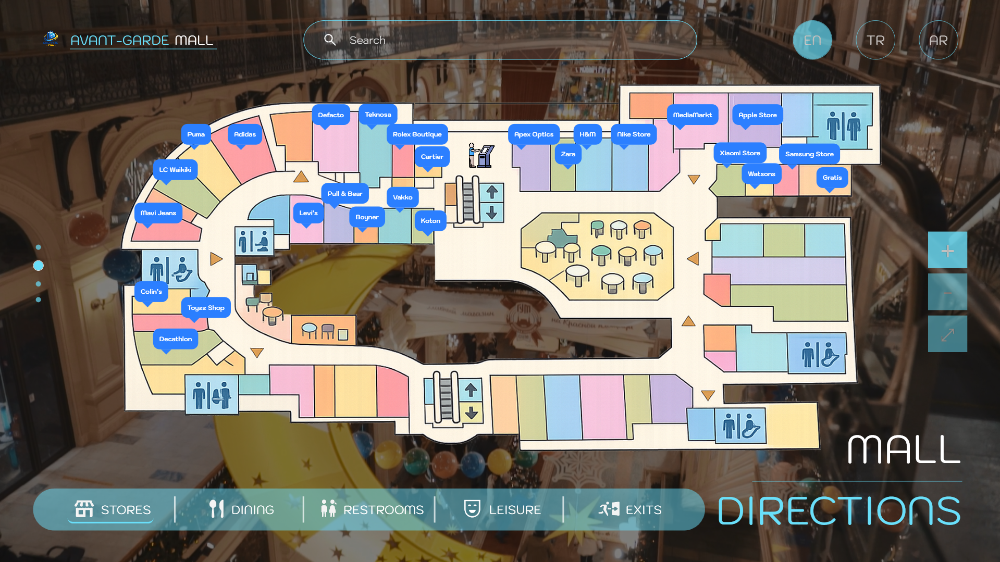
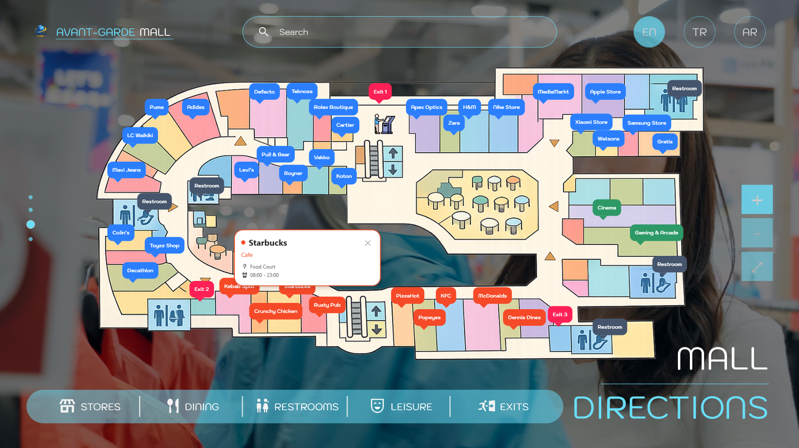
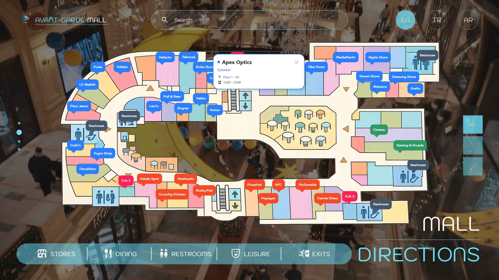
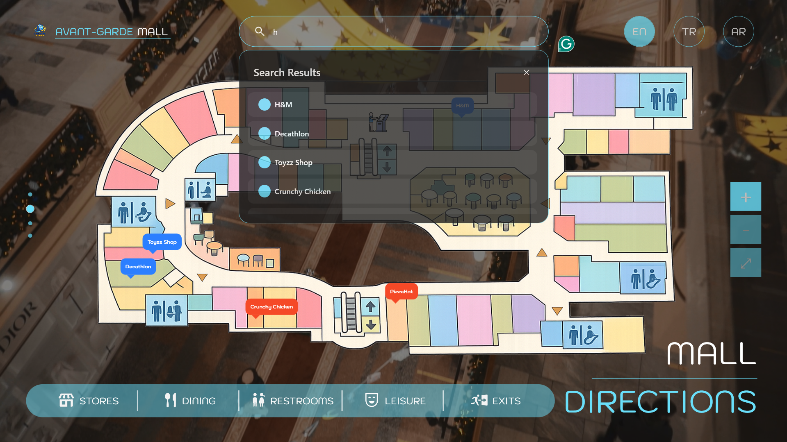
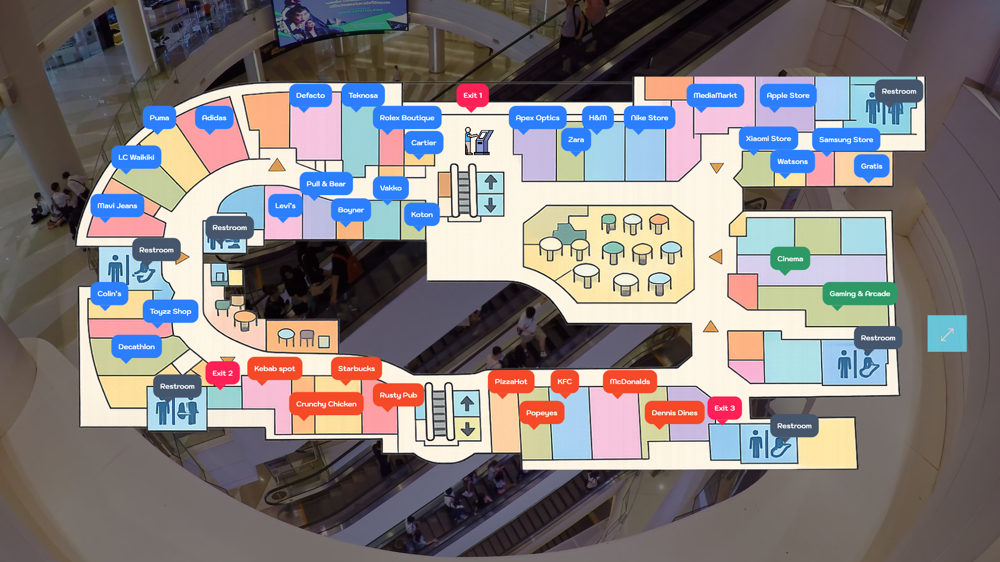

## Mall Navigator Kiosk

A modern, touch-friendly mall navigation kiosk application built with C#, WPF, and .NET Core.
Designed for large interactive displays, this system helps users easily explore mall layouts, stores, and services.





Sample Kiosk Mockup 


## • Features

### • Interactive Mall Map

- Navigate floors and store locations visually
- Smooth transitions and animations
- Smart Search
- Search for stores, categories, or services
- Fast and responsive filtering
- Multi-Language Support: Dynamic language switching (English, Turkish, Arabic)
- Localization using Resource Dictionaries
- Category Browsing: Stores, Dining, Restrooms, Services, etc.
- Easy filtering and navigation
- Media Integration: Video playback support (ads, promos, guides)
- Handles media lifecycle (play, loop, end events)
- Kiosk Mode
- Fullscreen experience
- Restricted interaction (prevents exiting the app)
- Always-on-top behavior
- Performance Optimized
- Smooth UI rendering
- Lightweight architecture









- Language: C#
- Framework: .NET Core / .NET 8
- UI: WPF (Windows Presentation Foundation)
- Architecture: MVVM (Clean & Scalable),

## • Clone Repository
```bash 
    git clone https://github.com/Muhammedsuwaneh/mall-navigator-kiosk-app.git

    # Navigate to the project folder
    cd mall-navigator-kiosk-app

    # Build and run the project in Visual Studio
```

## • Licensed
Under [`MIT`](LICENSE) - Copyright 2026 

## • Version
1.0.0